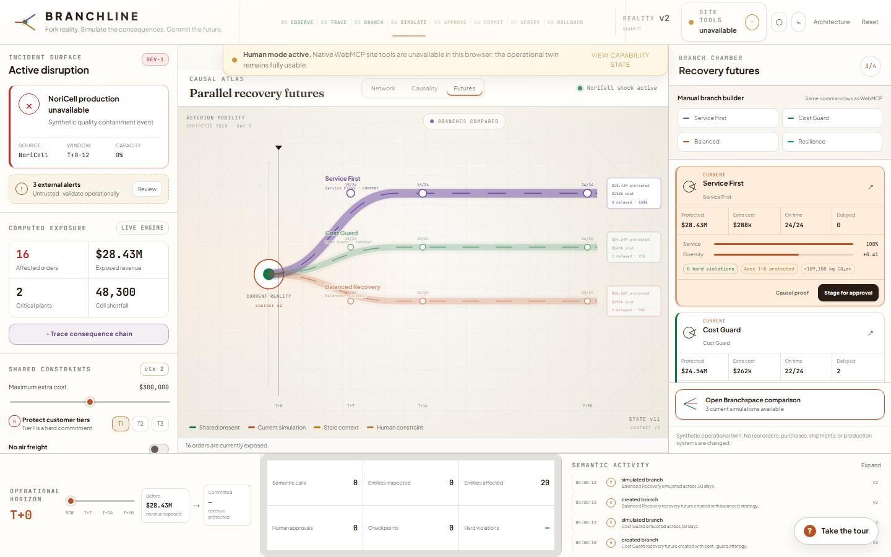

<p align="center">
  
</p>

# BRANCHLINE

**Live demo:** [https://branchline-flax.vercel.app](https://branchline-flax.vercel.app/?fresh=1)

**Repository:** [https://github.com/Shaunfurtado/branchline](https://github.com/Shaunfurtado/branchline)

**Fork reality. Simulate the consequences. Commit the future.**

BRANCHLINE is an agent-native operational recovery control plane that traces every consequence of a disruption, creates recoverable futures, and applies only the future a human approves.

**Demo video:** _Recording/upload URL pending. Script, storyboard, thumbnail, and captions are in `submission/`._

**Judge testing instructions:** [`submission/testing-instructions.md`](submission/testing-instructions.md) — no credentials required.

## Why this needs WebMCP

A supply-chain disruption is not one form submission. It is a causal investigation across suppliers, components, routes, plants, products, customer commitments, budgets, compatibility rules, approvals, execution, verification, and rollback. A browser agent working only through pixels or DOM inspection must rediscover those semantics on every step.

BRANCHLINE exposes the same domain operations used by its human interface as fourteen typed WebMCP tools. The page registers only capabilities whose preconditions currently hold. A human constraint edit changes the same live state the tools read, invalidates stale simulations, and removes unsafe capabilities immediately. Tool calls also drive visible causal animations, so semantic work remains legible to the person supervising it.

Official implementation references used during development:

- [OpenAI Site tools](https://developers.openai.com/codex/webmcp)
- [Chrome WebMCP overview](https://developer.chrome.com/docs/ai/webmcp)
- [Chrome Imperative API](https://developer.chrome.com/docs/ai/webmcp/imperative-api)
- [Chrome secure tools guidance](https://developer.chrome.com/docs/ai/webmcp/secure-tools)
- [WebMCP proposal repository](https://github.com/webmachinelearning/webmcp)

## Signature human–agent interaction

1. The human triggers a twelve-day NoriCell outage.
2. The agent traces the computed cascade and creates three strategy branches.
3. The human directly protects `order_1082` for Apex Health Logistics.
4. A gold intent wave enters the graph; every old branch becomes stale.
5. `stage_plan` and `apply_plan` disappear until a branch is recomputed.
6. The agent re-simulates the balanced future against that exact human-edited context.
7. The agent stages the plan, but cannot approve it.
8. The human approves the exact simulated diff in the BRANCHLINE interface.
9. Only then is `apply_plan` registered.
10. The agent commits, verifies, explains the causal tradeoff, and can roll back to an exact checkpoint.

> Humans steer intent. Agents traverse consequences. BRANCHLINE keeps both inside the same live operational twin.

## Featured demo

The deterministic synthetic world models Asterion Mobility, a commercial EV-platform manufacturer with 12 suppliers, 9 component types, 3 plants, 3 hubs, 10 lanes, 4 products, 8 customers, 24 orders, inventory lots, purchase orders, compatibility rules, capacity limits, costs, transit times, reliability, and simplified emissions factors.

The featured shock is computed from that data:

- 16 affected orders;
- 2 critically constrained plants;
- **$28.43M** exposed revenue;
- 48,300 battery cells of near-term shortfall.

The four deterministic strategies produce materially different results. In the featured seed, the pre-lock `cost_guard` future delays the Apex order; after the human locks it, a recomputed balanced branch reallocates scarce Helix inventory to Pune and delays a lower-priority order instead.

Use **Reset** at any time to return exactly to the healthy featured state. Use the copy control in the incident rail for the canonical judge prompt.

## Architecture

```text
Human UI ─┐
          ├─ shared command bus → domain engine → one live state
WebMCP ───┘
```

```text
Domain command
  → validate preconditions and invariants
  → mutate the centralized store
  → increment state/context versions
  → append audit provenance
  → emit a visual event
  → reconcile the native WebMCP registry
  → render the same change for the human
```

The application is a zero-runtime-dependency static TypeScript client. It uses custom SVG rendering rather than a generic graph library. Business outcomes are produced by the planner and 31-step daily simulator, not by display constants. Local persistence keeps the demo state across refreshes; `?fresh=1` starts clean and `?debug=1` opens the developer capability lab.

See [`docs/ARCHITECTURE.md`](docs/ARCHITECTURE.md), [`docs/DOMAIN_MODEL.md`](docs/DOMAIN_MODEL.md), and [`docs/WEBMCP.md`](docs/WEBMCP.md).

## WebMCP tool table

| Tool | Kind | Dynamic availability |
|---|---|---|
| `get_ops_snapshot` | Read-only | Always |
| `inspect_entity` | Read-only | Always |
| `trace_impact` | Read-only | Always |
| `list_constraints` | Read-only | Always |
| `find_substitutes` | Read-only | Always |
| `read_external_alerts` | Read-only, untrusted content | Always |
| `create_branch` | Stateful planning artifact | Active disruption, before execution |
| `simulate_branch` | Stateful planning artifact | At least one branch |
| `compare_branches` | Read-only | At least two current simulations |
| `explain_tradeoff` | Read-only | At least one current simulation |
| `stage_plan` | Stateful | At least one valid current simulation, no staged plan |
| `apply_plan` | Consequential | Exact current plan approved by a human in the UI |
| `verify_plan` | Read-only | Executed plan |
| `rollback_plan` | Stateful | Executed plan with a checkpoint |

Every object schema sets `additionalProperties: false`, validates again at runtime, uses bounded fields, and returns a compact structured success/failure envelope. Native registration is visible in [`src/webmcp/registry.ts`](src/webmcp/registry.ts) and [`src/webmcp/definitions.ts`](src/webmcp/definitions.ts).

## Dynamic capability lifecycle

```text
HEALTHY
  6 inspection tools
      ↓ trigger shock
DISRUPTED
  + create_branch
      ↓ create branch
BRANCHING
  + simulate_branch
      ↓ one current simulation
SIMULATED
  + explain_tradeoff + stage_plan
      ↓ two current simulations
COMPARABLE
  + compare_branches
      ↓ stage
AWAITING HUMAN
  apply_plan intentionally absent
      ↓ human approves exact diff
APPROVED
  + apply_plan
      ↓ commit
EXECUTED
  + verify_plan + rollback_plan
```

Any disruption, route, inventory, global-constraint, or human-order-lock change increments `contextVersion`. Simulations retain the context version and hash on which they were based. A mismatch marks them stale, revokes staging/approval, aborts obsolete registrations, and removes `apply_plan`.

The **Agent Capability Surface** shows the actual native registry and separately explains why potential tools are locked. When available, it reconciles against `document.modelContext.getTools()` and listens for `toolchange`.

## Safety and approval model

- There is no `approve_plan` WebMCP tool.
- Approval is an exact human record bound to the plan, context version, simulation hash, and summary hash.
- A stale approval cannot execute.
- `apply_plan` is absent—not merely disabled—before approval.
- Apply is transactional and idempotent; a checkpoint is created before state changes.
- Verification compares actual committed metrics with the simulated promise.
- Rollback restores the exact operational snapshot while preserving the append-only audit trail.
- The Voltra-to-ORION incompatibility is enforced inside allocation and invariant checks.
- External alert text is annotated as untrusted, returned as plain text, escaped in the UI, and never treated as instruction.
- No API key, secret, real customer data, analytics, backend, or production integration is present.

See [`docs/SECURITY.md`](docs/SECURITY.md).

## Simulation methodology

The simulator advances day 0 through day 30. Each day applies disruptions, supplier availability, arrivals, compatibility, inventory allocation, plant capacity, order priority, production, fulfillment, delivery timing, costs, penalties, concentration, and simplified emissions indicators. It records a daily snapshot at every step.

Core metrics are derived as follows:

```text
revenue_at_risk = sum(revenue for orders projected late or unfulfilled)
revenue_protected = disrupted_baseline_risk - branch_risk
service_level = on_time_revenue / total_revenue
incremental_cost = supplier delta + logistics delta + changeover cost + expected lateness penalties
supplier_concentration = sum(supply_share²)
emissions_delta = mode_factor × distance × shipped_weight relative to baseline
```

The candidate planner enumerates compatible source mixes, transport modes, inventory transfers, resequencing, and eligible deferrals; simulates each candidate; rejects hard violations; then applies the documented deterministic strategy score with a stable action-signature tie-break. See [`docs/DOMAIN_MODEL.md`](docs/DOMAIN_MODEL.md).

## Local setup

Prerequisites: Node.js 22 or newer and Python 3.11 or newer. The TypeScript 5.8.3 compiler is pinned as a local file dependency under `vendor/`, so the normal install and build do not require registry access.

```bash
npm install
npm run dev
```

Open `http://127.0.0.1:5173/?fresh=1`.

If you only need to view the app without rebuilding, the repository ships a verified static build in `dist/`:

```bash
npm run preview
```

Open `http://127.0.0.1:4173/?fresh=1`.

Other useful commands:

```bash
npm run build
npm run preview
npm run capture
```

### Windows notes

- `npm run dev` and `npm run build` compile TypeScript into `dist/` before serving. If a build fails, `dist/` may be empty and the local server will not start; rerun `npm run build` and confirm it prints `Built BRANCHLINE into dist/.`.
- `python3` is used by the serve and capture scripts. If `python3` is not on your PATH, use `py -3` instead or add a Python launcher alias.
- `npm run preview` serves the existing `dist/` folder and does not rebuild first. Use it when you want the fastest path to the bundled demo.
- `npm run test`, `npm run lint`, and `npm run verify` are supported on Windows. Earlier releases used Unix-only shell commands for test cleanup; current scripts use Node for cross-platform builds.

The application remains fully usable when WebMCP is unavailable. It shows a compact fallback notice and never pretends that native site tools are connected.

## Compatible-browser setup

For a real agent demonstration, use a current environment that implements Site tools/WebMCP, such as the supported built-in browser in the current ChatGPT desktop app. Browser and workspace rollout can vary, so confirm the address-bar **Site tools** control shows BRANCHLINE’s tools.

For Chrome experimentation, follow the current [Chrome WebMCP documentation](https://developer.chrome.com/docs/ai/webmcp) rather than relying on a hardcoded flag name. Serve the app over HTTP with:

```text
Origin-Agent-Cluster: ?1
Permissions-Policy: tools=(self)
```

Do not use `document.domain` or `Origin-Agent-Cluster: ?0`. BRANCHLINE ships no production WebMCP polyfill. The native-like model context in `e2e/webmcp_mock.py` is injected only by tests and captures.

## Test commands

```bash
npm run typecheck
npm run lint
npm run test
npm run check:tools
npm run build
npm run test:e2e
npm run verify
```

`npm run test:e2e` requires Python Playwright and Chromium. It launches the verified production build, injects a test-only native lifecycle mock before page code, executes the canonical flow through registered tool definitions, checks the approval boundary, and tests 1024×768, 1440×900, and 1920×1080 layouts.

See [`docs/TESTING.md`](docs/TESTING.md), [`docs/EVALS.md`](docs/EVALS.md), and the final [`docs/VERIFICATION_REPORT.md`](docs/VERIFICATION_REPORT.md).

## Project structure

```text
src/
  app/          command/lifecycle selectors
  components/   command-center UI and overlays
  data/         deterministic featured scenario
  domain/       graph, impact, planner, simulator, scoring, invariants
  store/        one centralized operational state and persistence
  visual/       deterministic layouts and visual event helpers
  webmcp/       schemas, handlers, native definitions, registry lifecycle
  tests/        domain and WebMCP tests
e2e/            Chromium canonical-flow, responsive, and security tests
scripts/        build, serve, lint, tool budgets, E2E, screenshot capture
docs/           architecture, security, evals, testing, judging evidence
submission/     prompts, Devpost copy, testing instructions, video plan, captions, thumbnail, screenshots
```

## Synthetic-data disclosure

**Synthetic operational twin. No real orders, purchases, shipments, or production systems are changed.**

All manufacturers, suppliers, customers, products, orders, routes, costs, reliability values, and operational events are fictional. Risk, concentration, and emissions are simplified planning indicators, not production-certified estimates.

## Limitations

- WebMCP remains experimental and support depends on the current browser/agent rollout.
- The simulation is deliberately bounded and deterministic; it is not an optimizer for real procurement or manufacturing decisions.
- The application has no ERP, TMS, WMS, supplier, identity, or payment integration.
- Data persistence is browser-local and intentionally single-user.
- Emissions and risk metrics are simplified synthetic indicators.
- The included browser test mock validates registration and lifecycle mechanics but is not presented as an external agent. A submission recording should show a real compatible browser agent.
- Live application and public repository are published; demo video upload remains a separate credentialed step.

## License

BRANCHLINE source is licensed under the [MIT License](LICENSE). The vendored TypeScript compiler remains under its upstream Apache-2.0 license; see [`THIRD_PARTY_NOTICES.md`](THIRD_PARTY_NOTICES.md).
